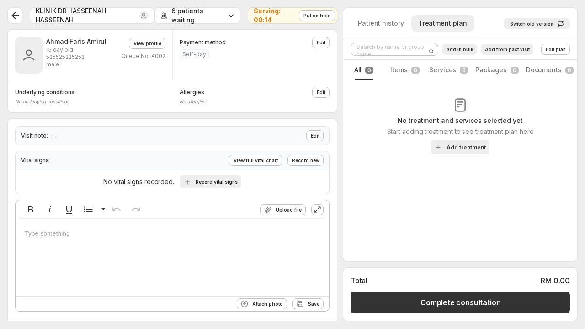
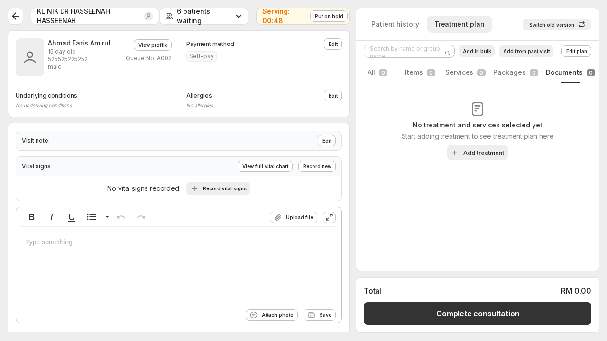
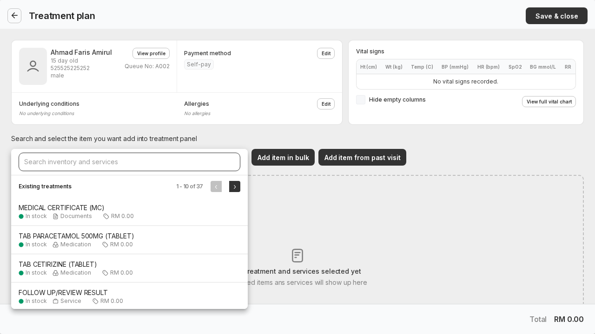
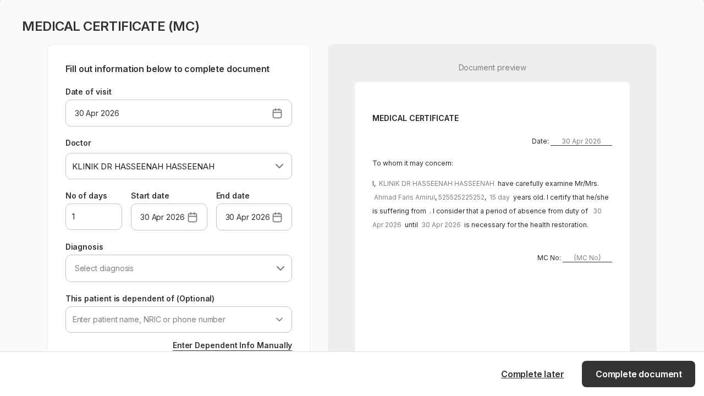
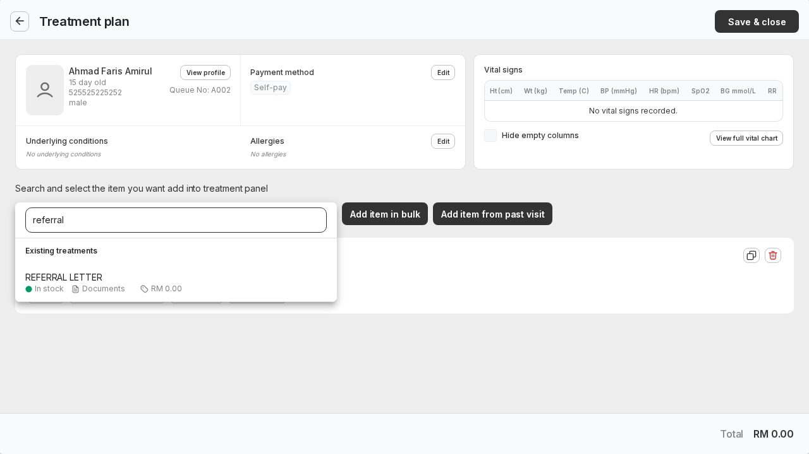
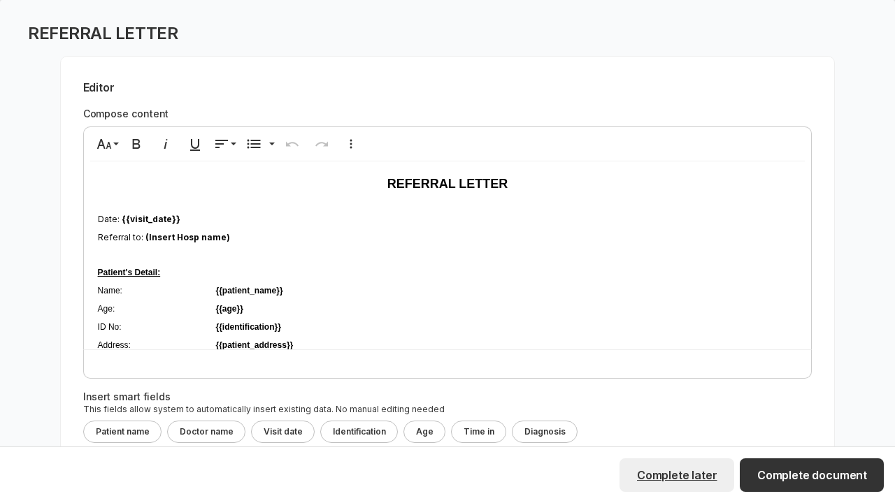
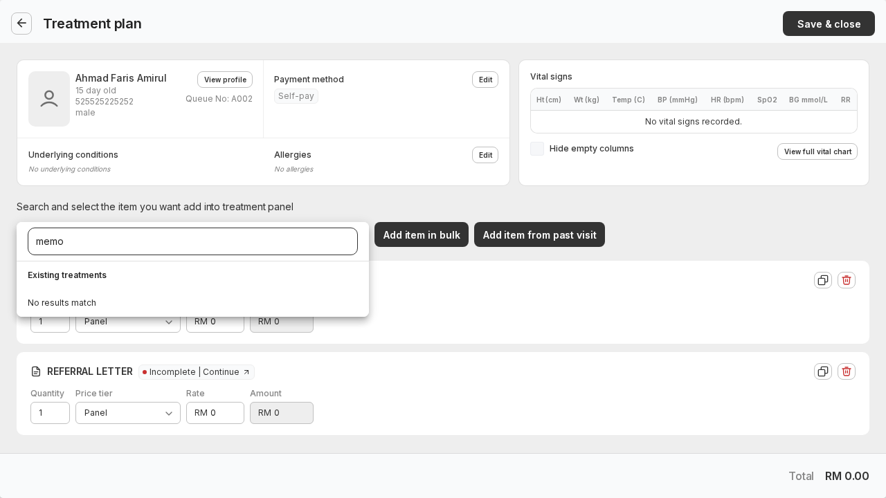

# Yezza — Demo Walkthrough & Workflow Reference

## Overview

| Field | Value |
|---|---|
| Environment | `https://dashboard.yezza.com/signin/clinic?slug=demoaccount` |
| Initial walkthrough date | 2026-04-05 |
| Workflow documentation date | 2026-04-06 |
| Basis | Live exploration and end-to-end testing in the Yezza demo clinic account |

This document combines:

1. A detailed UI walkthrough of every module in the Yezza demo account (screens, fields, actions, observed behavior)
2. An operational workflow document describing how the clinic currently works end to end

---

## Overall workflow map

The current clinic workflow centers on five active operational modules:

1. Appointment
2. Registration
3. Consultation
4. Reviews
5. Purchase Hub

Supporting administration and configuration live under Settings.

Core patient journey:

1. Patient is booked through the appointment workflow or arrives as a walk-in
2. Front desk handles patient registration
3. Registration routes the visit into one of two paths:
   - Consultation queue
   - OTC invoice/checkout path
4. Doctor works the patient inside Consultation
5. Completing consultation moves the patient into Dispensary
6. Payment, invoicing, and related billing logic are controlled by checkout and payment settings

---

## What was directly verified

Verified with live actions in the demo:

- login
- new patient creation
- existing patient search
- consultation registration handoff to waiting queue
- OTC registration handoff to checkout
- appointment creation for an existing patient
- appointment persistence in patient profile
- consultation completion moving patient from `Serving now` to `Dispensary`
- settings subpages and their destinations

Verified example records created or used:

- Patient created: `syarahbeema`
- Appointment created: `22 Apr 2026`, `10:00 AM – 11:30 AM`, service `First time`, provider `Bryan Mbeumo`
- Consultation completion verified on: `AHMAD FIRDAAUS BIN ZULKIFLI`

---

## 1. Login and global layout

URL:

- `https://dashboard.yezza.com/signin/clinic?slug=demoaccount`

Login page elements:

- Title: `Log in to Demo Account Yezza`
- Username field
- Password field
- Password visibility toggle
- `Log In` button
- `Sign in with email instead` button

Observed issue on load:

- Large number of failed CSS/JS asset requests in console before authentication; page still rendered and login worked

Post-login primary navigation:

- Registration
- Appointment
- Consultation
- Reviews
- Purchase Hub

Global header controls:

- Brand/logo link back to settings
- Display size control showing `Large`
- Profile/avatar menu

Profile/avatar dropdown:

- Account settings
- Clinic management
- Log out

Account identity shown:

- `KLINIK DR HASSEENAH HASSEENAH`
- Role: `Doctor, Clinic Assistance`

---

## 2. Appointment

URL: `https://dashboard.yezza.com/admin/clinic/appointment`

### Summary strip

- Period selector: `This month`
- Upcoming / Completed / Cancelled / No-show counts
- Potential sales
- `Switch to calendar view`

### Tabs

Upcoming · Completed · No-show · Cancelled · To be scheduled · Appointment request

### Table columns

Name · Date · Schedule time · Services · Providers · Payment · Sent Status · Actions

Demo data visible:

- Upcoming: `Evelyn Grace Tan`, `Ben test`, `annisha`
- Providers: `Bruno Fernandes`, `KLINIK DR HA...`, `Bryan Mbeumo`
- Payments: `N/A`, `Unpaid`
- Sent status: `Pending`, `Sent`

### Appointment creation flow (verified end to end)

Wizard steps: **1. Details → 2. Patient → 3. Payment**

**Step 1 — Details:**

- Service type, Doctor, Appointment date, Available time, Notes, Override toggle
- Date picker stays read-only until a doctor is selected
- Time options generated after date selection, in 30-minute increments
- Observed services: `FOLLOW UP/REVIEW RESULT`, `Health Screening___`, `First time`, `Complete body checkup`, `OEUK Medical Examination`, `Petronas Medical Offshore`
- Observed providers: `Bryan Mbeumo`, `Bruno Fernandes`, `Southern Health Centre Taman Pelangi`, `KLINIK DR HASSEENAH HASSEENAH`

**Step 2 — Patient:**

- Searchable lookup picker (same style as registration)
- Shows Name, NRIC/Passport, Email, Phone, Address after selection
- Patient is hard-required before proceeding

**Step 3 — Payment:**

- Shows service name and booking fee amount
- `Record payment now` / `Record payment later`
- `Confirm booking` stays disabled until one option is chosen
- Verified booking fee: `RM 10.00`

**Verified created appointment:**

- Patient: `syarahbeema` · Date: `22 Apr 2026` · Time: `10:00 AM – 11:30 AM`
- Service: `First time` · Provider: `Bryan Mbeumo` · Payment: `Unpaid`
- Appointment appeared correctly in patient profile `Appointments` tab after creation

### Appointment management actions (from row action menu)

- Mark as arrived
- Reschedule to a new date
- Cancel this appointment
- Create follow-up appointment
- Record payment
- Mark sent status as pending

Reschedule opens a modal showing patient, service, doctor, current schedule, and current status before allowing changes.

### Calendar layout

- Monthly mini-calendar with previous/next month navigation
- Provider filter list with multi-select checkboxes
- Day view timeline · `Today` shortcut · View mode dropdown (`Day`) · `Add` button
- Right-side empty-state panel for selected events

---

## 3. Registration

URL: `https://dashboard.yezza.com/admin/clinic/registration`

Registration is the main front-desk orchestration step. It decides whether the patient enters the consultation queue or the OTC checkout path.

### Queue tabs

All · Schedule for today · Waiting · Serving now · Dispensary · Completed · Cancelled

- `All`: general registration queue table
- `Schedule for today`: appointment-style list (Name, Date, Time, Services, Providers, Payment)
- `Waiting`: active queue rows; can also contain `On hold` patients
- Tab labels show live queue counts

### Queue table columns

Patient · Queue · Arrive at · Visit notes · Doctor · Payment · Duration · Status

### Filter chips

Name · Age · Urgency · Arrived date · Doctor · Panel Payment Method · Reset filters

### Registration entry points

- Search existing patient (searchable picker; demo had `1 – 20 of 80` existing patients)
- `Read from MyKad` (hardware-dependent; not exercised)
- `Add new patient`

### New patient registration flow

**Step 1 — Patient information:**

Fields: Name, NRIC/Passport, Phone, Email, Date of birth, Gender, Nationality, Race, Religion, Address (Line 1/2, Postcode, City, State, Country), Emergency contact (name, phone)

Structured sections: Staff IDs (Panel, Staff ID), Medical information (Underlying conditions, Allergies), Additional info (Management checkboxes, Check the entry pass, Other — free-text)

Observed validation:
- Nationality required
- Custom `Management` section required in this demo
- Phone validation required a valid Malaysian-style number (`0123456789`)

Patient created:

- Name: `syarahbeema` · NRIC/Passport: `P1234567` · Gender: Female · Nationality: Malaysia

**Step 2 — Visit information:**

Patient-side summary card (photo/avatar, Name, Age, NRIC/passport, `View profile`, `Edit`)

Supplementary panels:
- Family member status (`Add now`)
- Underlying conditions summary
- Allergies summary with `Edit`
- Upcoming appointment summary with `View all` and `Add new`

Operational controls:

| Control | Options |
|---|---|
| Visit purpose | Consultation / OTC |
| Doctor | selector |
| Visit notes | text |
| Billing person | Self / Dependent |
| Payment method | Self-pay, Intracare Sdn Bhd, … |
| Urgent | checkbox |
| Label print | action |
| Vital signs | `Record new` / `Record vital signs` |

Visit-purpose behavior:
- Default is `Consultation` → submit button is `Send to waiting area`
- Switching to `OTC` → submit button changes to `Go to invoice`

Billing behavior:
- Switching to `Dependent` opens an `Edit billing info` modal with existing-patient lookup, Name, Phone, NRIC/Passport, Address, Relationship selector
- Modal note: `For panel claiming purpose only`

### Existing patient registration flow

1. `Register` → `Search existing patient`
2. Searchable dropdown/popup (Name, NRIC/passport, or phone)
3. Select patient → jumps directly to `Visit information` (skips demographic entry)
4. Searching `syarahbeema` narrowed list correctly to the newly created patient

### Registration branching logic

#### Path A — Consultation

1. Register → Create/select patient → Visit information → keep `Consultation` → `Send to waiting area`

Result:
- Success toast: `Patient registered successfully`
- Patient appears in queue with number, arrival time, payment type, elapsed wait time, status
- Verified: `syarahbeema` → queue `A001`, status `Waiting`

#### Path B — OTC

1. Register → Create/select patient → Visit information → switch to `OTC` → `Go to invoice`

Result:
- Redirected to checkout route: `/admin/clinic/checkout/<invoice_id>`
- Verified: `/admin/clinic/checkout/nlwdd5n`
- Invoice page showed: Invoice `#366`, patient summary, `Call in`, `View activity log`, `Switch old version`, Bill-to section, Treatment tabs (All, Items, Services, Packages, Documents), `Add treatment`, Payments block, `Submit e-Invoice`, `Complete visitation`
- API errors against `/invoices/<invoice_id>/einvoice` on load; page still remained usable

### Queue row actions

For the `syarahbeema` row:
- `Edit visit details` (reopens Visit information editor)
- `View vital sign`
- `Print queue number`
- `Call to`
- `Cancel visit`

### Patient profile (opened from registration)

Breadcrumb: Patient database → patient

Summary: Name, NRIC/passport, Age, Total spend, Total visit, Since date

Details: Email, Phone, Birthday, Gender, Nationality, Address, Emergency contact, Staff IDs, Underlying Conditions, Allergies

Tabs: Visits · Documents · Files · Billings · Family · Appointments

Behavior: new patient profile showed one visit entry matching the registration event immediately after creation.

---

## 4. Consultation

URL: `https://dashboard.yezza.com/admin/clinic/consultation`

### Queue states

Waiting · Serving now · On hold · Dispensary · Completed · All

Consultation is a state-machine around a patient queue, not a single screen.

### Table columns

Patient · Queue · Arrive at · Visit notes · Doctor · Payment · Duration · Status

Row actions: `View` · `Call in`

Observed queue behavior in session:
- `Waiting` was empty
- `Serving now` had active patients
- `Dispensary` had multiple patients

### End-to-end consultation flow (verified)

1. Open `Consultation` → enter a queue state (e.g. `Serving now`) → open patient via `View`
2. Work inside consultation workspace
3. Click `Complete consultation`
4. Patient leaves `Serving now` and appears under `Dispensary`

Verified example:
- Patient: `AHMAD FIRDAAUS BIN ZULKIFLI` · Queue: `A001` · Payment: `Self-pay`
- `Serving now` count: 4 → 3; `Dispensary` count: 11 → 12
- Same patient appeared in `Dispensary` with duration reset to `<1 min`

Consultation detail URL: `https://dashboard.yezza.com/admin/clinic/consultation/4bkm34p`

### Consultation workspace

**Patient summary panel:** Name, ID/NRIC, Age, Gender, Allergy, Payment type, Queue/waiting duration, `Call patient in`

**Serving-state header controls:** Back/nav, Current doctor/clinic, Waiting-count indicator, Serving timer, `Put on hold`

**Visit note editor:** Rich text (Bold, Italic, Underline, Unordered list, Undo/Redo, Attach photo, Save), `View vital signs`

**Diagnosis and next-step actions:** Select diagnosis, Set appointment, Upload file

Observed diagnosis behavior: existing diagnoses appear as removable chips (e.g. `obesity`)

**Patient history section:**
- Filters: All, Dx, Meds, Servs, Docs
- Time range: `All time`
- Timeline/history entries grouped by date/time and doctor
- Contents: diagnosis list, vital-sign tables, case note narrative, treatment list with pricing, uploaded files, dispense note
- `View all visit summary`

**Medication/order table columns:** Item · Active · Qty · Price Tier · Rate · Amount · Dosage · Instruction · Frequency · Duration · Indication · Precaution

**Footer actions:** Total amount · `Call patient in` · `Start consultation`

### Treatment plan tab

- Search by name or group name
- `Add in bulk` · `Add from past visit` · `Edit plan`
- Category tabs: All · Items · Services · Packages · Documents
- The `Documents` tab starts empty when no document has been added
- Verified document rows/search results: `MEDICAL CERTIFICATE (MC)`, `REFERRAL LETTER`, `QUARANTINE LETTER`
- Search for `memo` returned `No results match` in this demo account
- Document rows show completion state (`Incomplete | Continue`, `Completed | Edit`) plus quantity, price tier, and amount fields
- Non-document rows remain searchable from the same selector, e.g. `TAB PARACETAMOL 500MG`, `TAB CETIRIZINE`, services, investigations, and bundles

Screenshots:

### Consultation documents

Documents are added from `Treatment plan` → `Documents` / `Add treatment` → search inventory and services.

**Medical Certificate (MC):**

- Search term: `medical` or visible in default first page as `MEDICAL CERTIFICATE (MC)`
- Category: Documents
- Price: RM 0.00 in demo
- Selecting it opens a structured MC form and live preview
- Fields observed: Date of visit, Doctor, No of days, Start date, End date, Diagnosis, optional dependent patient/dependent manual info
- Actions: `Complete later` · `Complete document`
- Diagnosis was not prefilled; the preview showed a blank diagnosis sentence until a diagnosis is selected
- Observed wording issue in preview for a 15-day-old patient: `15 day years old`

**Referral letter:**

- Search term: `referral`
- Category: Documents
- Price: RM 0.00 in demo
- Selecting it opens a rich-text editor with live document preview
- Toolbar includes font size/style, bold, italic, underline, alignment, lists, undo/redo, more text, and insert table controls
- Smart fields observed: Patient name, Doctor name, Visit date, Identification, Age, Time in, Diagnosis
- Template content includes `{{visit_date}}`, `{{patient_name}}`, `{{age}}`, `{{identification}}`, `{{patient_address}}`, `{{patient_gender}}`, `{{diagnosis}}`, `{{doctor_name}}`, and `{{doctor_mmc_no }}` placeholders
- Actions: `Complete later` · `Complete document`

**Memo:**

- Search term tested: `memo`
- Result: `No results match`
- No memo document template was available in this demo account during this run

### Vital-sign recording modal

Fields: Date, Time, Height, Weight, Blood pressure, Pulse, Temperature, Blood glucose, SpO2, Respiratory rate

Actions: `Cancel` · `Save`

### Follow-up appointment from consultation

Entry points: `Create new appointment`, `Add appointment`, `Set appointment`

`Set appointment` modal fields: Service type, Doctor, Appointment date, Available time, Notes, Override toggle, `Advanced appointment`, `Confirm`

Structurally identical to the standalone appointment module but exposed inline.

### Consultation completion behavior

- `Complete consultation` executes immediately (no confirmation modal in this run)
- Returns UI to the consultation queue screen
- Moves patient from `Serving now` to `Dispensary`
- Completion is a workflow state transition, not just a note-save

---

## 5. Reviews

URL: `https://dashboard.yezza.com/admin/clinic/review`

Tabs: Google review · Internal feedback · Invitations

Actions: icon-only utility buttons · `Get more reviews`

### Current state (demo limitation)

- Summary widgets stayed in loading state
- Overlay/scrim intercepted clicks, blocking normal tab switching into `Internal feedback` and `Invitations`
- Onboarding wizard still opened and progressed normally

### Onboarding flow observed

**Step 1 — Add review site:**
- Primary option: `Connect your Google Business page`
- Google account prefilled: `klinik seri anggun` (with `Change` control)
- Actions: `Cancel` · `Next`
- Selecting the option enabled `Next`

**Step 2 — Google Review link:**
- Instructions: search for clinic on Google Maps, copy review URL
- Input placeholder: `https://g.page/r/xxxxxxxxxxxxx/review`
- Actions: `Back` · `Connect`
- `Connect` disabled until a valid link is provided

---

## 6. Purchase Hub

URL: `https://dashboard.yezza.com/admin/clinic/purchase-hub`

Two areas: **Inventory** and **Purchases**

### Inventory area

Summary cards: In stock · Out of stock · Order soon

Category tabs: All · Order soon · Out of stock · Cardiovascular · Injections · (custom demo categories)

Table columns: Name · Stocks · Last 7D · Last 14D · Last 30D

Selected item side panel: `Selected item`, Create actions (Quotation, Purchase order)

### Purchases area

Metrics: Payment due · Overdue · Paid · Inventory stock received · Pending stock %

Tabs: Quotation · Purchase order · Invoice

Actions: icon-only buttons · `Create new`

Filters: Supplier · Reference · Status · Reset filters

Table columns: Supplier · Reference · Request status · Action

### Document creation flow

`Create new` → document selector:
- `Request for quotation (RFQ)`
- `Purchase order`
- `Record invoice from supplier`
- `Next` disabled until a type is selected

### Purchase order flow (verified)

1. `Create new` → `Purchase order` → `Next`
2. Fill order information (supplier, payment terms, PO date, due date)
3. Search/add inventory items
4. Review cost summary (subtotal, tax, adjustment, delivery charge, total, paid, amount due)
5. Add remarks and attachments
6. `Save as draft` or `Create and mark ordered`

**Supplier selector:**
- Search or add new: `Create new supplier`
- Demo suppliers: `Bkat Service Sdn Bhd`, `an nisa [pharmacy`, `JOV & MED`, `Pharmaniaga Berhad`, `Ehook`, `john_PVT_LTD`, `America_tutor`, `Infotech medice`, `Zuellig Pharma`

**Item table columns:** # · Item · Batch Number · Expiry Date · Requested · Received · Cost Per Item · Total Cost

Purchase Hub is document-driven (RFQ, PO, supplier invoice intake), not just an inventory listing.

---

## 7. Settings

URL: `https://dashboard.yezza.com/admin/clinic/settings`

Settings works as both a true admin-control surface and a launchpad into separate operational modules.

### Settings sitemap

**Clinic management — In-clinic:**
- Registration settings · Consultation settings · Checkout settings

**Inventory & services:**
- Inventory, services & packages → `/admin/clinic/inventory`
- Inventory invoices → `/admin/clinic/inventory-invoices`
- Settings

**Patients:**
- Information & medical records → `/admin/clinic/patients`
- Billing records → `/admin/clinic/billings`
- Segment and Blasting → `/admin/clinic/segments`

**Appointment:**
- Appointment calendar → `/admin/clinic/appointment/calendar`
- Settings → `/admin/clinic/manage`

**Reviews:**
- Reviews & feedbacks → `/admin/clinic/review`

**Queue:**
- Settings → `/admin/clinic/settings/queue-system`
- Queue screen → opens new tab `https://demoaccount.yezza.co/qtv` (external display)

**Scheduling:**
- Users → `/admin/clinic/users`
- Rooms & equipments → `/admin/clinic/settings/facilities`

**Documents:**
- Templates → `/admin/clinic/settings/document/templates`
- Drug label → `/admin/clinic/settings/document/drug-label`

**Reports:**
- Medicine reports · Sales reports · Panel reports · Stock Movement Report

**Panel:**
- Panel reports · Panel invoices
- Claims message templates → `/admin/clinic/panels/settings/claim-message-template`

**e-Invoice:**
- Single and Consolidated e-invoice → `/admin/clinic/einvoice`
- Settings → `/admin/clinic/settings/e-invoice`

**Business management:**
- Business details · Tax settings · Payment gateway

**User management:**
- Users

### Registration settings (verified)

URL: `.../settings/registration-settings`

System-required (locked): Name · Phone number · NRIC/Passport

Clinic-controlled: Patient image · Email · Date of birth · Gender · Nationality · Race · Religion · Address · Emergency contact

Queue behavior: Clear queue time; `I don't want to clear my queue automatically`

Observed state: Date of birth, gender, and nationality were enabled; auto-clear override was enabled.

### Consultation settings (verified)

URL: `.../settings/consultation-settings`

Purpose: Maintain the diagnosis list used in consultation.

Tabs: All · Active · Archived; `Add diagnosis`; toggle and row action menu per diagnosis

Visible diagnoses: `turber`, `obesity`, `PAMOL`, `CAP`, `VIRAL FEVER`, `Elective Wellness Therapy - Liver Detox`, `asthma`, `fracture`

### Checkout settings (verified)

URL: `.../settings/checkout-settings`

Panel payment examples: `Intracare Sdn Bhd`, `Malaysia_SIM`, `Razarpay`, `AIA`, `PMCARE`

Self-pay payment examples: `online`, `TNG`, `CARD`, `Online Transfer`, `Credit Card`, `Debit Card`, `QR Pay`, `Cash`

### Appointment public booking management (verified)

URL: `.../manage`

Public booking link: `https://demoaccount.yezza.co/appointment`

Tabs: General · Patient form · Provider · Services · Sharing

Providers visible: `Yong`, `Blue Pie`, `Bryan Mbeumo`, `Mattheus Cunha`, `Bruno Fernandes`, `KLINIK DR HASSEENAH HASSEENAH`

### Queue system settings (verified)

URL: `.../settings/queue-system`

Sections: Configuration · Room setup · Queue display

Configuration: Clear queue timing, call by Number/Name, Custom numbering group toggle

Rooms visible: `therapy room`, `Operation (OPD)`, `TREATMENT`, `Nurse counter`, `CONSULTATION`

Queue display: Ratio (16:9/4:3), Media type (Video/Images), Display/voice language (English, BM, Off), scrolling text, company logo, theme-color, live preview panel (called patients by name; 4-room TV-style mockup)

### Business details (verified)

URL: `.../settings/business-details`

Fields: Clinic name, Address, Phone, Email, Logo, Registration type/number, GST/SST registration numbers, Bank account details

Demo values: `Demo Account Yezza` · `Rawang` · `Selangor`

### Tax settings (verified)

URL: `.../settings/tax`

Controls: Default tax toggle, default tax selector, `Add tax`

Examples: `accessories` 12.0% · `City_TAX` 50.0% · `Checking1234` 50.0% · `SST` 6.0%

### e-Invoice settings (verified)

URL: `.../settings/e-invoice`

Fields: TIN, MSIC, Registration Type/Number, Company address

State: Form rendered and was editable; console showed a failed API fetch, but form still displayed.

### Payment gateway (verified)

URL: `.../settings/payment-gateway`

State: Route exists and shows a `Payment gateway settings` card; no provider-specific form populated in this demo state.

### Templates (verified)

URL: `.../settings/document/templates`

Tabs: All · Medical certificate · Prescription letter · Medical records · Billings

Examples: `Govt card`, `SIJIL SUNTIKAN TYPHOID`, `QUARANTINE LETTER`, `TIME SLIP`, `REFERRAL LETTER`, `PRESCRIPTION LETTER`, `SIMPLE RECEIPT`, `ITEMIZED`, `INVOICE`, `MEDICAL CERTIFICATE (MC)`

### Drug label (blocked)

URL: `.../settings/document/drug-label`

State: Shell loaded with title but body stayed in skeleton state; error banner: `Unable to complete your request. Please try again later`

---

## 8. Workflow role summary

### Front desk

- Appointment: view planned bookings
- Registration: create/select patient, assign doctor, set payer
- Waiting queue handoff for consultation cases
- Invoice handoff for OTC cases

### Doctor / consultation staff

- Consultation queue states
- Patient consultation workspace: diagnosis, treatment planning, vitals, follow-up scheduling
- Completion handoff to Dispensary

### Back office / admin

- Settings: registration rules, payment methods, queue setup, taxes, business identity, templates
- Procurement flow in Purchase Hub
- Users and facilities management

---

## 9. Known issues observed in the demo

| # | Issue | Severity |
|---|---|---|
| 1 | Login page: large number of failed asset requests in console before auth | Low — page still worked |
| 2 | Reviews module: stuck in loading state; overlay blocks tab interaction | Medium — onboarding wizard still opened |
| 3 | Drug label settings: failed to load; shows error banner/skeleton | Medium |
| 4 | e-Invoice settings: renders but produces a failed network request | Low |
| 5 | e-Invoice module: blocks with `e-Invoice Setup Required` gate; not configured in demo | Expected for demo state |
| 6 | Icon-only buttons on several pages reduce clarity and accessibility | Low |

---

## 10. Workflow dependencies

The current workflow depends on these configuration areas being correct before go-live:

- Registration settings
- Checkout settings
- Appointment manage page
- Queue system settings
- Business details
- Tax settings
- e-Invoice settings

If these are misconfigured, operational flows are affected at runtime.

---

## 11. Key handoffs summary

| Handoff | From | To |
|---|---|---|
| 1 | Appointment | Registration |
| 2 | Registration (Consultation) | Consultation queue |
| 3 | Registration (OTC) | Checkout / Invoice |
| 4 | Consultation | Dispensary |
| 5 | Settings | Operational behavior of all modules |

---

## 12. Screenshot index

Legacy screenshots were originally stored in `/Users/hidayat/Documents/Projects/UCC/output/playwright/yezza-screenshots/`. Updated in-repo screenshots are stored in `docs/assets/yezza-screenshots/`.

| File | Description |
|---|---|
| `01-login-page.png` | Login screen |
| `02-registration-list.png` | Registration queue/list layout |
| `03-registration-register-patient-modal.png` | Register patient chooser modal |
| `04-registration-patient-information.png` | Patient information form layout |
| `05-appointment-list.png` | Appointment list layout |
| `06-appointment-new-modal.png` | New appointment modal |
| `07-consultation-list.png` | Consultation queue layout |
| `08-consultation-detail.png` | Consultation detail workspace |
| `09-reviews-page.png` | Reviews module with onboarding/loading state |
| `10-purchase-hub.png` | Purchase Hub layout |
| `11-settings-page.png` | Clinic settings/admin sitemap |
| `12-profile-menu.png` | Account/profile dropdown menu |
| `13-registration-existing-patient-search.png` | Existing-patient picker opened from registration |
| `14-registration-existing-patient-search-filtered.png` | Existing-patient picker filtered to `syarahbeema` |
| `15-registration-visit-information-existing-patient.png` | Visit information modal after selecting existing patient |
| `16-registration-dependent-billing-modal.png` | Dependent billing modal from visit information |
| `17-registration-patient-profile.png` | Patient profile opened from registration via `View profile` |
| `18-registration-otc-checkout-handoff.png` | Checkout page after choosing OTC and `Go to invoice` |
| `19-appointment-calendar-layout.png` | Appointment calendar/day-view layout |
| `20-appointment-reschedule-modal.png` | Reschedule modal from appointment row actions |
| `21-patient-appointments-tab-with-created-booking.png` | Patient profile appointments tab showing created booking |
| `22-appointment-wizard-details-step.png` | Appointment wizard step 1 details layout |
| `23-consultation-dispensary-list-after-complete.png` | Dispensary queue after completing a consultation |
| `24-consultation-workspace-serving.png` | Active consultation workspace in serving state |
| `25-consultation-treatment-plan.png` | Treatment-plan tab inside consultation |
| `26-consultation-record-vitals-modal.png` | Record-vital modal inside consultation |
| `27-consultation-set-appointment-modal.png` | Embedded follow-up appointment modal inside consultation |
| `28-reviews-onboarding-shell.png` | Reviews landing page with onboarding shell and blocked content |
| `29-reviews-connect-google-account-step.png` | Review setup: connect Google Business page step |
| `30-reviews-google-link-step.png` | Review setup: Google review link step |
| `31-purchase-hub-create-document-selector.png` | Purchase Hub document-type selector from `Create new` |
| `32-purchase-hub-purchase-order-form.png` | New purchase order form layout |
| `33-purchase-hub-supplier-selector.png` | Supplier dropdown/search inside purchase order form |
| `34-settings-registration-settings.png` | Registration settings — required patient-detail controls |
| `35-settings-consultation-settings.png` | Consultation diagnosis-list management |
| `36-settings-checkout-settings.png` | Checkout settings — panel and self-pay payment methods |
| `37-settings-appointment-manage.png` | Appointment booking management — provider configuration |
| `38-settings-queue-system.png` | Queue system settings — config, room setup, preview |
| `39-settings-business-details.png` | Business details — clinic identity and registration info |
| `40-settings-tax-settings.png` | Tax settings — default tax and tax table |
| `41-settings-einvoice-settings.png` | e-Invoice settings form |
| `42-settings-payment-gateway.png` | Payment gateway settings shell |
| `43-settings-templates.png` | Templates management — categories and status toggles |
| `44-settings-drug-label-error.png` | Drug label settings error/loading state |
| `45-consultation-treatment-plan-active.png` | Active consultation Treatment Plan tab |
| `46-consultation-documents-tab-empty.png` | Documents tab empty state before adding documents |
| `47-consultation-document-search-mc.png` | Document selector showing Medical Certificate (MC) |
| `48-consultation-medical-certificate-form.png` | Medical Certificate form and live preview |
| `49-consultation-document-search-referral.png` | Document selector filtered to Referral Letter |
| `50-consultation-referral-letter-editor.png` | Referral Letter rich-text editor, smart fields, and preview |
| `51-consultation-document-search-memo-no-results.png` | Memo search showing no matching document template |

---

## Final state of the created demo patient

- Name: `syarahbeema`
- Queue number: `A001`
- Status: `Waiting`
- Payment: `Self-pay`
- Registration timestamp: `5 Apr 2026 10:51 PM`
